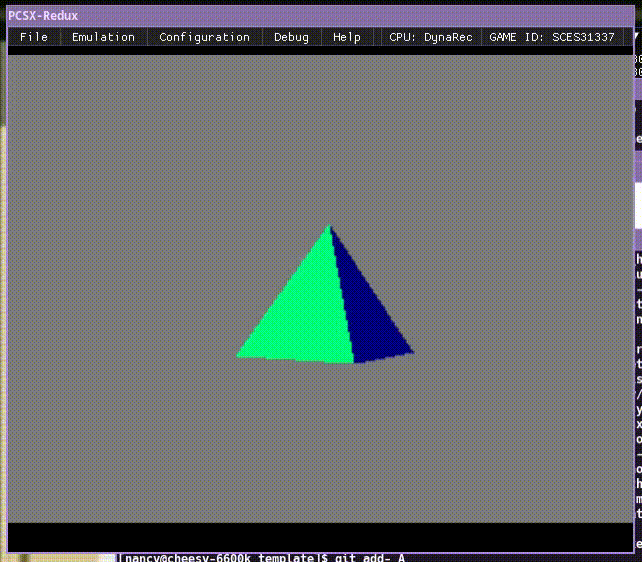
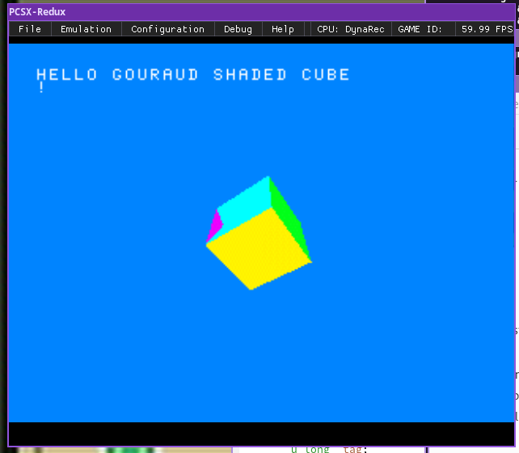
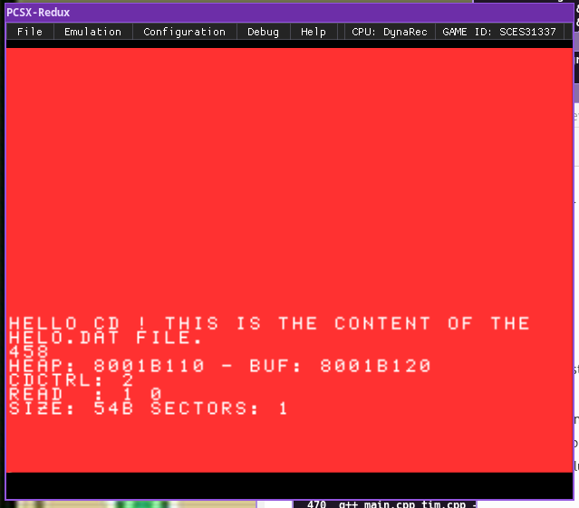

# Nancy's PSX project template (Nugget + Psy-Q on \*nix)

___Big WIP!!! the state of the project right now is likely not necessarily exactly wha ti hav described here XD___

This is Nancy's template for beginning new Playstation software projects written in C! :3

This README documents all of the steps I personally took in accomplishing my current setup, and this template project represents the current state of my continually growing familiarity with writing software for the PSX using [Nugget + Psy-Q](https://github.com/ABelliqueux/nolibgs_hello_worlds). 😌☕

Also I think my goal here will be to develop this into a little toolkit on top of Nugget + Psy-Q for myself. Not an entire game engine, but just a toolkit for making things nice and neat and easy to then go on and build multiple different types of engines! :o

This is for \*nix environments **only**! >:3

Also this assumes you have standard and typical command line tools installed. Stuff like `git`, `wget`, `make`, `7z`, `mkdir`. XD!

(Let me know if something here is wrong or messed up or if you have questions or trouble or complaints or w/e XD)



## Contents

* [Setup](#setup)
    * [Setup overview](#setup-overview)
    * [Setup procedure](#setup-procedure)
        * [Building the toolchain](#building-the-toolchain)
            * [Building Binutils](#building-binutils)
            * [Building GCC](#building-gcc)
            * [Troubleshooting Binutils/GCC build](#troubleshooting-binutils-gcc-build)
        * [Setting up Psy-Q](#setting-up-psy-q)
            * [Testing Psy-Q and toolchain](#testing-psy-q-and-toolchain)
            * [Setting the Psy-Q path environment variable](#setting-the-psy-q-path-environment-variable)
        * [Building IMG2TIM](#building-img2tim)
        * [Building MKPSXISO](#build-mkpsxiso)
            * [Testing MKPSXISO](#testing-mkpsxiso)
* [Build](#build)
* [Run](#run)
    * [Running in an emulator](#running-in-an-emulator)
    * [Running on real hardware](#running-on-real-hardware)
* [Starting your own project](#starting-your-own-project)
* [Links](#links)

## <a name="setup">Setup</a>

First I'll tell you what you need, and then I'll tell you how to get it! XD

### <a name="setup-overview">Setup overview</a>

Here is a quick list of what you need:
- GCC toolchain to cross compile to `mipsel-none-elf`.
- The converted Psy-Q SDK
- Utilities like IMG2TIM and MKPSXISO
- Emulator like PCSX-Redux or real Playstation modded with modchip or custom firmware like UniROM

You need a modern GCC toolchain, the conversion of the official Psy-Q SDK that has been made to work with said modern GCC toolchain, and a few other tools.

So you will need [GNU Binutils](https://www.gnu.org/software/binutils/) and [GNU GCC](https://gcc.gnu.org/) compiled and configured for target platform `mipsel-none-elf`.

And you will also need the converted Psy-Q SDK, which you can get from this repository of [examples](https://github.com/ABelliqueux/nolibgs_hello_worlds).

For certain tasks, such as converting image formats and creating CD-ROM images, you will need a few other tools, such as [IMG2TIM](https://github.com/lameguy64/img2tim) and [MKPSXISO](https://github.com/Lameguy64/mkpsxiso) (both by [LameGuy64](lameguy64.net/)).

For testing the results you can use an emulator of your choice (I like [PCSX-Redux](https://pcsx-redux.consoledev.net/)) or you can run it on a real Playstation (e.g. with a modchip or custom firmware such as [UniROM](https://unirom.github.io/)).

### <a name="setup-procedure">Setup procedure</a>

#### <a name="building-the-toolchain">Building the toolchain</a>

If you already have an up-to-date build of GCC and Binutils configured with `mipsel-none-elf` as the target platform, then you can skip this section and continue on to [Setting up Psy-Q](#setting-up-psy-q)!

Otherwise if you need to compile your own compiler, here's how to do it!

##### <a name="building-binutils">Building Binutils</a>

1) First obtain the latest [source tarball for Binutils](https://ftp.gnu.org/gnu/binutils/) and extract it to some directory.
2) Open a terminal and change directory to the source root directory: e.g. ```cd binutils-2.37``` _(your version may be different and thus have a different filename!)_
3) Run the configure script specifying the target platform like this: ```./configure --target=mispel-none-elf``` _(Note that if you want to configure it to be installed to a non-default prefix, specify it with an extra configure option, for example, like so: ```--prefix=/usr``` (e.g. if you want your installation prefix to be `/usr` instead of the default.)
4) Then start the build: ```make```
5) And if it built successfully, install all of the binaries to their appropriate place like this: ```sudo make install```

##### <a name="building-gcc">Building GCC</a>

1) Now to build GCC, obtain from one of their mirrors the latest [source tarball for GCC](https://gcc.gnu.org/mirrors.html) and extract to some directory.
2) Open a terminal and change directory to the source root directory: e.g. ```cd gcc-11.2.0``` _(your version may be different and thus have a different filename!)_
3) Create a new directory to perform the build in like this: ```mkdir build``` and then change directory to it.
4) Run the configure script specifying the target platform and other options like this: ```../configure --target=mipsel-none-elf --enable-languages=c --with-gnu-as --with-gnu-ld --disable-shared --disable-nls --disable-threads --disable-multilib``` (If you used a custom prefix to build Binutils, you want to add that same prefix here too by specifying it as an extra configure option exactly the same way as you did for the Binutils configure script.)
5) Start the build: ```make```
6) And if everything went well, install the binaries: ```sudo make install```

##### <a name="troubleshooting binutils-gcc-build">Troubleshooting Binutils/GCC build</a>

_TODO: write about what to do if you get certain errors like unknown option -EL or certain commands not found n stuff_

After I had successfully setup my toolchain on my main PC, I wanted to set it up on my laptop as well, and thought I could get away with simply copying over the binaries. And that did end up working, but it turns out there are more necessary files to copy over than the obvious binaries themselves. If there are are any errors about unknown options or commands not found, then it's probably trying to invoke the wrong binaries because it can't find the right ones, which have to be present and in a specific place. (_TODO: figure out the details of this and write more about it XD_)

#### <a name="setting-up-psy-q">Setting up Psy-Q</a>

Once the toolchain is built, you need the converted Psy-Q SDK.

1) Clone [this repository](https://github.com/ABelliqueux/nolibgs_hello_worlds) somewhere on your hard disk like this: ```git clone https://pcsx-redux.consoledev.net/ --recursive```
2) Change directory into the new repository: ```cd nolibgs_hello_worlds```
3) Then you have to download converted Psy-Q: ```wget http://psx.arthus.net/sdk/Psy-Q/psyq-4.7-converted-full.7z```
4) And extract it to `psyq`: ```7z x psyq-4.7-converted-full.7z -o./psyq```
5) Test one of the demos!: ```make hello_cube```

##### <a name="testing-psy-q-and-toolchain">Testing Psy-Q and toolchain</a>

If everything's worked so far, there should be in the `hello_cube` directory a `.ps-exe` Playstation executable file (this is a program image that contains a program to be loaded into the Playstation's RAM, and isn't to be confused with the CD image which probably contains far more data than can fit in RAM at one time!) that you can for example drag and drop onto the PCSX-Redux emulator window in order to load it, and it should show a rotating cube!



##### <a name="setting-the-psy-q-path-environment-variable">Setting the Psy-Q path environment variable</a>

A particularity for building this template project is that you must define an environment variable containing the path to the `nolibgs_hello_worlds` directory. This is for the convenience of being able to place your PSX project directories wherever you like and because this template relies on the Makefiles present in that repository.

The environment variable that is expected is `NOLIBGS_PATH` and, for example, mine is set to `/home/nancy/psx/nolibgs_hello_worlds` because that's where I have placed the repository in my filesystem.

You can define this variable by including it before the `make` command used to build this template project, by preceding `make` with e.g. `NOLIBGS_PATH=/home/nancy/psx/nolibgs_hello_worlds` (it would look like this: ```NOLIBGS_PATH=/home/nancy/psx/nolibgs_hello_worlds make```)

Or, more preferably, you can define this variable persistently by exporting it in your `.bashrc` configuration file (or equivalent for whatever shell you use) by placing the following line somewhere in that file: ```export NOLIBGS_PATH=/home/nancy/psx/nolibgs_hello_worlds```

If you define the variable in the configuration file like this, it will take effect once you start a new shell instance (open a new terminal, etc.).

#### <a name="building-img2tim">Building IMG2TIM</a>

1) Clone the [IMG2TIM repository](https://github.com/lameguy64/img2tim): ```git clone https://github.com/lameguy64/img2tim```
2) Change directories to the source root directory: ```img2tim```
3) Make sure you have the [FreeImage library](https://freeimage.sourceforge.io/) installed! (I installed mine via Arch Linux repositories. _TODO: instructions for manual install_)
4) I was able to compile IMG2TIM with the following command: ```g++ -lfreeimage main.cpp tim.cpp -o img2tim```
5) Then I installed it by copying the produced `img2tim` binary to some directory in my PATH. (In my case, `~/bin` is in my PATH, so I just copied it there, hehe.)

#### <a name="building-mkpsxiso">Building MKPSXISO</a>

_(Following the compile instructions currently present [the repository's](https://github.com/Lameguy64/mkpsxiso) README, maybe follow that instead for more in depth and up to date instructions if needed)_

1) Clone the [MKPSXISO repository](https://github.com/Lameguy64/mkpsxiso) like so: ```git clone https://github.com/Lameguy64/mkpsxiso```
2) Change directories to the source root directory: ```cd mkpsxiso```
3) Clone submodules: ```git submodule update --init --recursive```
4) Run the following build commands: ```cmake -S . -B ./build -DCMAKE_BUILD_TYPE=Release && cmake --build ./build && sudo cmake --install ./build```

##### <a name="testing-mkpsxiso">Testing MKPSXISO</a>

If everything has worked so far, you should now be able to build CD-ROM iso images!

Test it by entering the nolibgs demos directory again: ```cd nolibgs_hello_worlds```

And go to the `hello_cd` subdirectory: ```cd hello_cd```

Build it: ```make``` (More particular instructions should be available in the `README.md` in that directory.

If it worked, it should have produced `hello_cd.cue` and `hello_cd.bin` which you should be able to load in an emulator. If everything is setup correctly so far it should look like this:



## <a name="build">Build</a>

Once you know your build setup is working, that you can successfully compile programs and produce working `.bin` and `.cue` files, you can build this template project by simply running ```make``` in the source root directory. This will produce `.bin` and `.cue` files in the `build` subdirectory that you can load in an emulator or burn to a CD and play load on real Playstation that has been modded with a modchip or with custom firmware.

Make sure your `NOLIBGS_PATH` variable [has been defined](#setting-the-psy-q-path-environment-variable)!

_TODO: troubleshooting in case it doesnt work… 😱_

## <a name="run">Run</a>

You might want to run the result in an emulator or on real hardware! :0

### <a name="running-in-an-emulator">Running in an emulator</a>

You can open the resulting `.bin` and/or `.cue` files in any emulator you like, of course, but the one I like for debugging is [PCSX-Redux](https://pcsx-redux.consoledev.net/)!

_TODO: how to compile PCSX-Redux_

### <a name="running-on-real-hardware">Running on real hardware</a>

There are different ways you can get your own programs running on a real Playstation, but the way I'm interested in trying is with [UniROM](https://unirom.github.io/).

_TODO: write instructions for setting this up after I've done it myself! 0-0_

## <a name="starting-you-own-project">Starting your own project</a>

Of course, this is a project template that I want to serve as a useful starting point for new projects, so once everything is working, all that's left is to start changing stuff and adding stuff!!! >:3

Maybe use the resources below to figure out how to do cool stuff. XD

## <a name="links">Links</a>

Here are a bunch of links I've found really helpful!:3
- [A collection of links for resources related to PSX development](https://ps1.consoledev.net/)
- [An quick guide to getting started with PSX development](https://psx.arthus.net/starting.html)
- [LameGuy64's PSX programming tutorial series](http://lameguy64.net/svn/pstutorials/index.html) (the username and password are both `annoyingmous`)
- [PCSX-Redux PSX emulator oriented towards development/debugging/reverse engineering](https://github.com/grumpycoders/pcsx-redux)
- [Martin Korth's Playstation technical specifications document](https://psx-spx.consoledev.net/)
- [Joshua Walker's Playstation technical research document](http://hitmen.c02.at/files/docs/psx/psx.pdf)
- [Rodrigo Copetti's practical analysis of Playstation architecture](https://www.copetti.org/writings/consoles/playstation/)
- [MIPS32 ISA reference](https://app.box.com/s/5917337e62e9d034c6c1)
- [Nolibgs examples](https://github.com/ABelliqueux/nolibgs_hello_worlds)
- [Nolibgs wiki](https://schnappy.xyz/nolibgs/)
- [Playstation disk swap trick explanations](https://www.angelfire.com/ca/PlaystationHouse/SwapTrick.html)
- [UniROM bootdisc, custom firmware, and shell for PSX](https://unirom.github.io/)
- [PeterLemon's bare metal MIPS assembly examples for PSX](https://github.com/PeterLemon/PSX)
